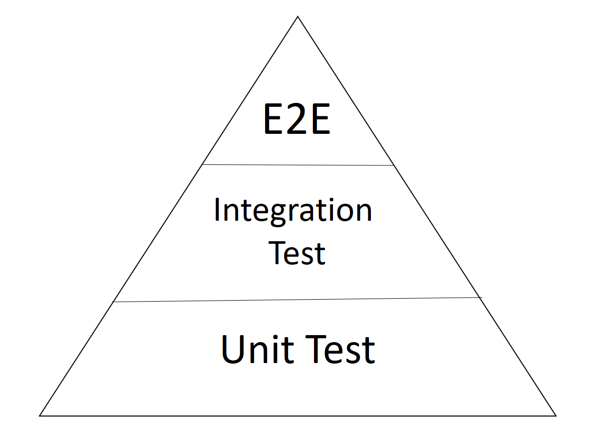

- Las pruebas unitarios son métodos que solo testean metodos dentro de las clases y si estos métodos necesitan acceso a otras clases se hace una simulación.

- Test de integracion test que hacen uso de otras clases si necesita acceso no van hacer simulados.

- E2E test que haria un usuario al probar le aplicación

*De la piramide podemos aprender, que entre mas arriba nos encontremos, menos pruebas vamos a realizar*

Con solo un test de E2E, por ejemplo que un usuario realize click en un botón y borre algun registro de una tabla. este comportamiento humano descadena muchos métodos y hace que se use muchos métodos y al final tendremos cubiertas muchas lineas de código pero no seremos tan precisos probando.

Con los Test Unitarios somos mas precisos, ya que son test mas lentos ya que hay que hacerlo por todos los métodos que deseamos testear. estamos limitados por la cantidad de métodos que seleccionemos, pero nos garantizan mas aun el correcto funcionamiento de una app.

Los Test unitarios no deben faltar en una app. podriamos añadir E2E pero no demasiados 

Un test unitario no deberia depender del llamado hacia otras clases, por que si el error esta en otras clases, ese error se arrastraria a nuestro test unitario y puede darse el caso que nuestro test este correcto y es la clase que se esta llamando la que falla o quizas nuestro test falla pero antes de darnos cuenta de eso ya tenemos el error del llamado hacia la otra clase, por eso en los test unitarios no debemos llamar a otras clases, mas bien debemos hacer una simulación de ellas y probar nuestro test unitario unicamente.